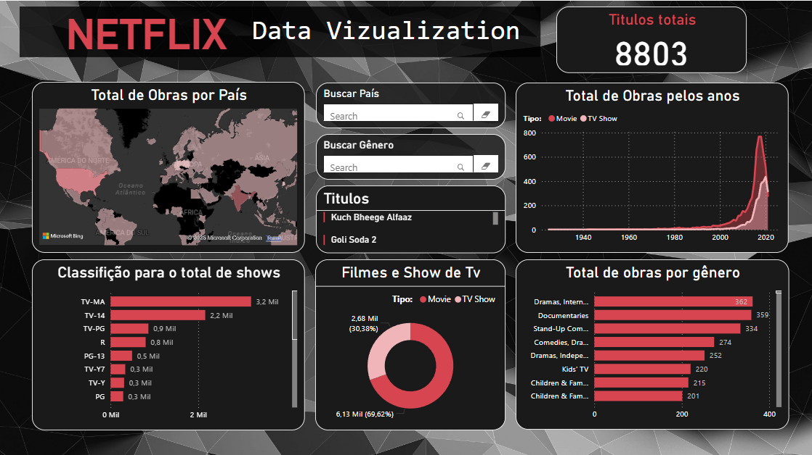

<!-- Banner no topo -->

# 🌐 Visualização de Dados

> Este estudo documenta a comparação entre quatro ferramentas de visualização de dados: **Power BI, Looker Studio, Tableau e Streamlit**. O objetivo é avaliar suas capacidades e identificar qual oferece a melhor experiência em termos de usabilidade, personalização, recursos e desempenho.
>
> Para tornar a análise mais abrangente, cada ferramenta foi testada com uma base de dados diferente, permitindo observar seu comportamento em distintos cenários. Os critérios de avaliação incluem facilidade de uso, flexibilidade, qualidade das visualizações e acessibilidade. Ao final, este estudo busca fornecer um panorama claro sobre as vantagens e limitações de cada ferramenta, auxiliando na escolha da opção mais adequada para diferentes necessidades.

---

  
  <strong>Power BI</strong>
    
  
O Power BI se mostrou uma ferramenta poderosa e intuitiva durante minha experiência de uso. Para entender melhor suas funcionalidades, utilizei um vídeo de referência no qual o instrutor usou uma base de dados do Prime Video para realizar uma análise. Inspirado por esse exemplo, trabalhei com uma base de dados da Netflix, exportada em CSV. Apesar de não ser muito pesada, o carregamento inicial demorou um pouco. No entanto, a base era bem completa e permitiu que eu explorasse várias funcionalidades da plataforma.

  
A personalização do modelo foi um ponto positivo. Consegui importar e ajustar uma imagem de fundo facilmente, embora, na versão web, não tenha sido possível adicionar imagens soltas. Sei que na versão desktop isso é viável, o que dá mais flexibilidade na criação dos dashboards.

  
A interface é bastante intuitiva, com todas as ferramentas organizadas nas barras à direita. Foi simples adicionar gráficos, selecionar os tipos de dados e aplicar filtros para remover valores nulos ou inconsistentes. Além disso, a personalização dos dashboards foi tranquila, com um sistema de grid que facilita o alinhamento dos elementos no painel.

  
Outro destaque foi a configuração do mapa, que se mostrou simples e funcional. Também pude modificar a paleta de cores conforme os dados apresentados, o que ajudou na visualização. No geral, não tive grandes dificuldades e, entre as plataformas que testei, o Power BI se destacou como a mais completa e eficiente.

  

    <h3>Pros</h3>
    <ul>
      <li>Fácil de usar</li>
      <li>Versão web e aplicativo para desktop</li>
      <li>Leve e eficiente</li>
      <li>Compatível com outras ferramentas da Microsoft (Excel, PowerPoint)</li>
      <li>Grande variedade de funcionalidades</li>
      <li>Ampla gama de customizações para gráficos</li>
      <li>Interface intuitiva</li>
      <li>Marketplace de visuais e filtros personalizados</li>
      <li>Layouts predefinidos</li>
      <li>Fácil importação de dados</li>
      <li>Transformação de relatórios em slides</li>
      <li>Automação de atualizações de dados</li>
      <li>Conexão com diversas fontes de dados</li>
      <li>Análise de dados em tempo real</li>
      <li>Recursos de Inteligência Artificial e Machine Learning</li>
      <li>Publicação e compartilhamento de relatórios</li>
      <li>Modo offline</li>
      <li>Filtros avançados e segmentações</li>
      <li>Suporte a scripts Python e R</li>
      <li>Exportação para PDF, Excel, PowerPoint e outros formatos</li>
      <li>Visualização geoespacial com mapas</li>
    </ul>
  

  

    <h3>Contras</h3>
    <ul>
      <li>Compatibilidade limitada com sistemas operacionais como macOS e Linux.</li>
      <li>Necessidade de uma conta Microsoft autenticada com acesso ao Office.</li>
      <li>Limitações no tamanho dos conjuntos de dados, especialmente na versão gratuita.</li>
      <li>Dependência de uma conexão estável com a internet para recursos baseados na nuvem.</li>
      <li>Possíveis problemas de desempenho ao lidar com grandes volumes de dados ou relatórios complexos.</li>
      <li>Necessidade de configuração adicional para garantir a segurança de dados sensíveis.</li>
      <li>Integração limitada com algumas fontes de dados não Microsoft.</li>
      <li>Atualizações frequentes podem exigir adaptações constantes por parte dos usuários.</li>
    </ul>
  

---

**Referência:** [Power BI - Vídeo Tutorial](https://www.youtube.com/watch?v=_xs8XXlGQVM&t=19s)  
**Dataset:** [Netflix Dataset no Kaggle](https://www.kaggle.com/code/chirag9073/netflix-data-analysis)

---

  
  <strong>Looker Studio</strong>
    
  
O Looker Studio foi a primeira ferramenta que testei, e, por conta disso, senti algumas dificuldades iniciais. Inicialmente, utilizei uma base de dados do **Spotify**, mas ela não atendia a todas as funcionalidades que eu gostaria de explorar. Em seguida, optei por uma base sobre o índice de inflação global, o que facilitou meu aprendizado na plataforma.
  

  
O Looker Studio oferece uma variedade considerável de gráficos, porém, adicionar dados aos dashboards não é tão intuitivo quanto no Power BI. A criação de filtros gerais mostrou-se um pouco confusa; somente após assistir a um vídeo no YouTube consegui configurá-los corretamente. Modificar o estilo dos gráficos e ajustar a abrangência dos dados (por exemplo, de 0 a 5M) é relativamente simples. No entanto, apesar de a base escolhida ser adequada, a plataforma não reconheceu os campos de país, nem por nome nem por código, impedindo a utilização de gráficos de mapas.

  
Em termos de desempenho, o Looker Studio mostrou-se eficiente em comparação com outras ferramentas. Após superar a fase inicial de aprendizado,  que considero um pouco desafiadora devido à interface menos intuitiva,  a utilização tornou-se mais fácil.
  

  

    <h3>Prós</h3>
    <ul>
      <li>Variedade de Gráficos</li>
      <li>Customização de Estilos</li>
      <li>Desempenho Satisfatório</li>
      <li>Integração com Produtos Google</li>
      <li>Ferramenta Gratuita</li>
      <li>Colaboração em Tempo Real</li>
      <li>Conexão Direta com Google Sheets e BigQuery</li>
      <li>Publicação e Compartilhamento Simples</li>
    </ul>
  

  

    <h3>Contras</h3>
    <ul>
      <li>Curva de Aprendizado</li>
      <li>Configuração de Filtros</li>
      <li>Reconhecimento de Campos Geográficos</li>
      <li>Dependência de Conectores de Terceiros</li>
      <li>Problemas Ocasionalmente Relatados</li>
      <li>Menos Recursos Avançados</li>
      <li>Interface Pouco Intuitiva</li>
      <li>Pouca Flexibilidade na Modelagem de Dados</li>
    </ul>
  

---

**Referência:** [Looker Studio - Vídeo Tutorial](https://www.youtube.com/watch?v=mYet7g4CvFQ&t=602s)  
**Dataset:** [Global Inflation Data no Kaggle](https://www.kaggle.com/datasets/sazidthe1/global-inflation-data)

---

   <strong>Tableau</strong>
    
  
Testei o Tableau com uma base de dados sobre fatores que influenciam no preço de apartamentos em Curitiba. A importação do dataset foi rápida e fácil, e a criação de gráficos também ocorreu sem dificuldades. No entanto, ao tentar personalizar os dados, percebi que a plataforma não é tão intuitiva quanto outras opções disponíveis.

  
O funcionamento do Tableau exige que cada gráfico seja criado separadamente antes de ser inserido no painel. Esse processo pode ser um pouco limitado, pois não há muita liberdade para posicionar os gráficos e incluir outros elementos além de títulos e filtros. A construção do dashboard foi o aspecto mais desafiador da experiência, sendo a ferramenta que menos ofereceu opções de customização entre as que testei. Ainda assim, quando o objetivo é criar gráficos de forma ágil e precisa, o Tableau apresenta um bom desempenho.

  

    <h3>Prós</h3>
    <ul>
      <li>Fácil de importar dados</li>
      <li>Boa variedade de gráficos</li>
      <li>Criação de gráficos rápida e precisa</li>
      <li>Bom desempenho na importação e geração de gráficos</li>
      <li>Integração com diversas fontes de dados</li>
      <li>Interface intuitiva para criação de gráficos</li>
      <li>Possibilidade de interatividade nos dashboards</li>
      <li>Suporte a grandes volumes de dados</li>
      <li>Atualização automática de dados conectados</li>
    </ul>
  

  

    <h3>Contras</h3>
    <ul>
      <li>Poucas opções de personalização</li>
      <li>Difícil posicionar gráficos no dashboard</li>
      <li>Construção de painéis é complicada e limitada</li>
      <li>Algumas funções só estão na versão paga</li>
      <li>Pode consumir muitos recursos em dados grandes</li>
      <li>Licenciamento pode ser caro</li>
      <li>Exportação de relatórios pode ser limitada</li>
      <li>Utilizei em teste gratuito</li>
    </ul>
  

---

**Dataset:** [Curitiba Apartment Prices no Kaggle](https://www.kaggle.com/datasets/wittmannf/curitiba-apartment-prices)

---

<strong> Streamlit</strong>
  
  
Testei o Streamlit utilizando uma base de dados do Spotify encontrada no Kaggle. A base era bem completa, o que permitiu explorar diversas funcionalidades da plataforma. No início, tive dificuldades para rodar o framework devido a problemas de configuração de ambiente, mas, após resolver essas questões, consegui começar o desenvolvimento.

  
Criar dashboards no Streamlit foi relativamente fácil para mim, pois já tenho familiaridade com programação. No entanto, para quem não tem experiência em Python, pode ser mais desafiador. A documentação do Streamlit, no entanto, é bem completa e oferece diversos exemplos para quem está começando. Além disso, a possibilidade de personalizar as visualizações com código Python foi uma vantagem significativa.

  
Uma das grandes vantagens do Streamlit é a flexibilidade que ele oferece ao trabalhar com dados em tempo real, uma vez que ele permite atualizações dinâmicas nas visualizações. No geral, o Streamlit foi uma ferramenta interessante, embora eu tenha notado que, devido à necessidade de habilidades de programação, ele não seja o mais acessível para iniciantes.

  

    <h3>Prós</h3>
    <ul>
      <li>Flexibilidade para personalizar com Python</li>
      <li>Permite a atualização em tempo real</li>
      <li>Ótima documentação</li>
      <li>Baseada em Python, com boa integração com bibliotecas populares</li>
      <li>Simples para quem conhece Python</li>
      <li>Ideal para desenvolvedores que buscam criar dashboards dinâmicos</li>
      <li>Comunidade ativa e crescente</li>
      <li>Possibilidade de utilizar scripts em Python diretamente</li>
      <li>Fácil implantação com integração ao GitHub</li>
    </ul>
  

  

    <h3>Contras</h3>
    <ul>
      <li>Necessário conhecimento de programação</li>
      <li>Curva de aprendizado alta para iniciantes</li>
      <li>Menos recursos visuais em comparação com outras ferramentas</li>
      <li>Não possui tantas opções de gráficos prontos</li>
      <li>Requer configuração do ambiente Python</li>
      <li>Requer servidor para visualizações dinâmicas em grande escala</li>
      <li>Menos intuitivo para quem não tem experiência em código</li>
    </ul>
  

---

**Referência:** [Streamlit - Tutorial](https://www.streamlit.io/learn)

**Dataset:** [Spotify Dataset no Kaggle](https://www.kaggle.com/datasets/jessevent/all-spotify-songs)

---

### Conclusão

O estudo comparou quatro ferramentas de visualização de dados: Power BI, Looker Studio, Tableau e Streamlit, com foco em usabilidade, personalização, recursos e desempenho.

- **Power BI** foi a ferramenta que se destacou por sua facilidade de uso, interface intuitiva e grande variedade de funcionalidades. Além disso, a integração com outras ferramentas da Microsoft e a flexibilidade na personalização dos gráficos e dashboards foram grandes pontos positivos. Embora a versão web tenha limitações, a versão desktop oferece ainda mais recursos, tornando o Power BI a ferramenta mais completa e eficiente, especialmente para usuários que já estão familiarizados com o ecossistema Microsoft. A única desvantagem é a limitação de recursos na versão gratuita e compatibilidade restrita com sistemas operacionais não-Microsoft.
- **Streamlit** é uma excelente ferramenta para quem tem experiência em programação, pois permite uma personalização avançada e integração com bibliotecas Python como Matplotlib, Seaborn e Plotly. A criação de dashboards é ágil, mas a curva de aprendizado é mais acentuada, principalmente para quem não tem experiência com código. A flexibilidade e a possibilidade de criar aplicativos interativos são grandes pontos a favor, mas o fato de exigir conhecimento técnico e configuração prévia coloca a ferramenta em segundo lugar no ranking.
- **Looker Studio** é uma ferramenta gratuita e eficiente para quem já utiliza o ecossistema Google. Oferece boas opções de personalização e integração com produtos como Google Sheets e BigQuery, além de permitir colaboração em tempo real. No entanto, sua curva de aprendizado é mais difícil, e a interface não é tão intuitiva quanto as demais. Além disso, a ferramenta apresentou limitações, como a falta de reconhecimento de campos geográficos e uma dependência de conectores de terceiros. Isso o coloca em terceiro lugar.
- **Tableau** é eficiente na criação de gráficos e na importação de dados, mas sua personalização de dashboards é limitada. A criação de painéis interativos é mais difícil em comparação com outras ferramentas, e a versão paga é necessária para acessar muitos recursos avançados. Apesar do bom desempenho e das opções de gráficos, o custo elevado e a falta de flexibilidade na construção de painéis colocam o Tableau em quarto lugar.

A escolha da ferramenta depende do nível de experiência do usuário e das necessidades específicas do projeto, como custo, flexibilidade e integração com outras plataformas.

